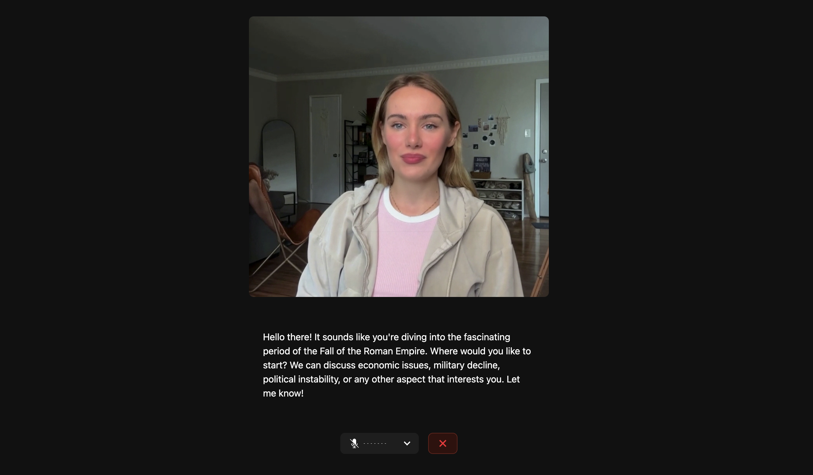

# Roman Empire Study Partner with Tavus Avatar

This is a voice-enabled educational assistant built with [LiveKit Agents](https://docs.livekit.io/agents) and [Tavus Avatars](https://tavus.io/). It creates an interactive learning experience focused on the Fall of the Roman Empire, featuring flash cards, quizzes, and Socratic teaching methods.

## Features

- **Conversational Learning**: AI tutor uses Socratic method to guide students through complex historical topics
- **Interactive Flash Cards**: Visual aids for key concepts that can be flipped to show questions or answers
- **Multiple-Choice Quizzes**: Test your knowledge with interactive quizzes that provide immediate feedback
- **Realistic Avatar**: Powered by Tavus for a more engaging visual learning experience



## Getting started

Run the following commands to set up the frontend:

```bash
cd voice-assistant-frontend
npm install
npm run dev
```

And open http://localhost:3000 in your browser.

You'll need to run the Tavus agent in a separate terminal:

```bash
cd avatars/tavus
python tavus.py
```

> [!NOTE]
> Make sure you've configured your environment variables in the `.env` file as described in the main README.

## How to Use

1. **Start a Conversation**: Begin asking questions about the Fall of the Roman Empire
2. **Use Flash Cards**: The agent will create flash cards for important concepts, which you can flip to see answers
3. **Take Quizzes**: The agent will periodically offer quizzes to test your knowledge
4. **Review Incorrect Answers**: Flash cards will automatically be created for questions you miss

## Contributing

This project is open source and we welcome contributions! Please open a PR or issue through GitHub, and don't forget to join us in the [LiveKit Community Slack](https://livekit.io/join-slack)!
