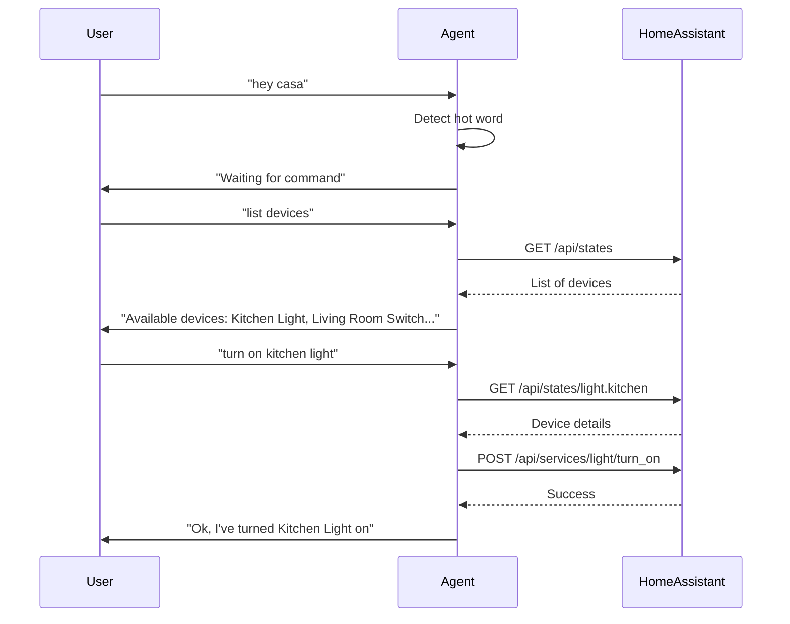

# Home Automation Voice Agent

This project provides a voice-controlled agent for interacting with your [Home Assistant](https://www.home-assistant.io/) setup. The agent listens for a hot word and allows you to list and control smart devices (like lights and switches) using natural language.

_(click image to see short YouTube video of agent controlling lighting)_  
[](https://youtu.be/IwDlZXJjsFY)

_(click image to see short YouTube video of agent controlling a TV lift)_  
[](https://youtu.be/mcz0MOzswV0)

## Requirements

- Python 3.8+
- Home Assistant instance (local or remote)
- The dependencies listed in `requirements.txt`

## Environment Variables

Create a `.env` file in the project root (or set these variables in your environment):

| Variable                | Description                                                      |
|-------------------------|------------------------------------------------------------------|
| `HOMEAUTOMAITON_TOKEN`  | Your Home Assistant long-lived access token                      |
| `HOMEAUTOMATION_URL`    | (Optional) Home Assistant base URL (default: `http://localhost:8123`) |

**Example `.env**:**

```
HOMEAUTOMAITON_TOKEN=your_home_assistant_token_here
HOMEAUTOMATION_URL=http://localhost:8123
```

## Usage

1. **Install dependencies:**
   ```
   pip install -r ../requirements.txt
   ```

2. **Set up your `.env` file** as described above.

3. **Run the agent:**
   ```
   python homeautomation.py start
   ```

4. **How it works:**
   - The agent waits for the hot word: **"hey casa"**.
   - After hearing the hot word, you can ask it to list devices or control them, e.g.:
     - "Hey casa, turn on the kitchen light."
     - "Hey casa, what lights are in the kitch?"
   - The agent will respond and control your Home Assistant devices accordingly.

## Features

- **Hot word detection:** Only responds after hearing "hey casa".
- **Device listing:** Lists available lights, switches, and binary sensors.
- **Device control:** Turn devices on or off by name.

## How It Works



## Troubleshooting

- Make sure your Home Assistant token is correct and has the necessary permissions.
- Ensure your Home Assistant instance is accessible from the machine running this script.
- Check the logs for connection or authentication errors.


## TODO

* Add ability to query non binary devices like thermostats and control them
* Make hot word more flexible and less prone to error